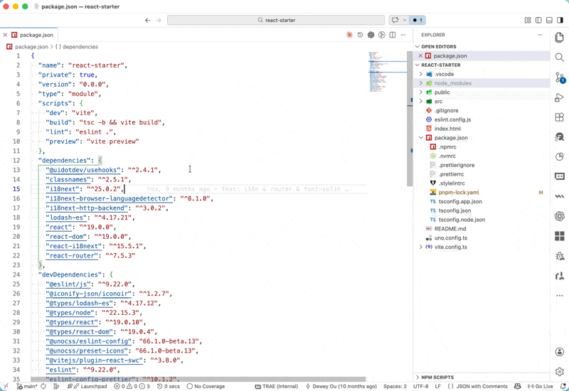

# Dep Jump

在 `package.json`（以及兼容的 `packages.json`）里，对 `dependencies`、`devDependencies`、`peerDependencies`、`optionalDependencies` 中的依赖名执行 `F12` / `Ctrl+Click`，即可跳转到对应依赖。

支持两类解析：

- 普通依赖：按当前 `package.json` 所在目录的 Node.js 解析路径逐级查找 `node_modules`，并用 semver 校验已安装版本是否满足声明版本。
- alias 依赖：支持 `npm:` 别名写法，例如 `npm:@universe-design/icons@3.186.1`，会按别名目录查找，但用真实包名和版本做校验。
- `workspace:*` 依赖：在当前 VS Code 工作区内查找同名 package，并优先跳到源码入口（如 `source`、`src/index.ts` 等），否则回退到该 package 的 `package.json`。

交互方式：

- `Cmd/Ctrl + Click`：优先走插件提供的文档链接，打开目标包的 `package.json`（兼容 `packages.json`）并自动在 Explorer 中执行 reveal。
- `F12`：走 VS Code 的 Go to Definition，同样会打开目标包的 `package.json`（兼容 `packages.json`）。
- Hover：悬停依赖名时会显示解析后的真实包名、版本信息、将打开的清单文件，以及解析到的入口文件。

## LICENSE

[MIT License](./LICENSE)